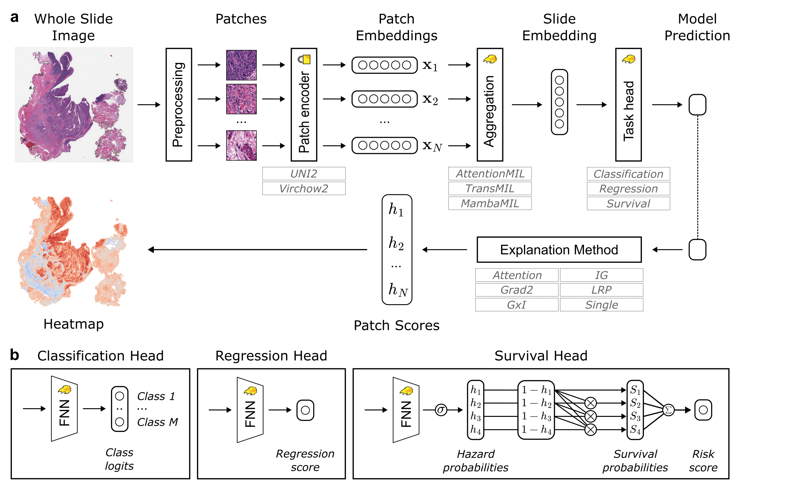

xMIL: Insightful Explanations for Multiple Instance Learning in Histopathology
==========


<details>
<summary>
  <b>xMIL: Insightful Explanations for Multiple Instance Learning in Histopathology</b>. NeurIPS 2024.
  <br><em>Julius Hense*, Mina Jamshidi Idaji*, Oliver Eberle, Thomas Schnake, Jonas Dippel, Laure Ciernik, 
Oliver Buchstab, Andreas Mock, Frederick Klauschen, Klaus-Robert Müller </em></br>
* Equal contribution

Accepted as a poster presentation at NeurIPS 2024.
- Proceedings: https://proceedings.neurips.cc/paper_files/paper/2024/hash/0f9e0309d8a947ca44463a9b7e8b6a3f-Abstract-Conference.html
- Open Review: https://openreview.net/forum?id=Y1fPxGevQj
- :octocat: https://github.com/bifold-pathomics/xMIL


</summary>

```
@inproceedings{hense2024xmil,
  author = {Hense, Julius and Jamshidi Idaji, Mina and Eberle, Oliver and Schnake, Thomas and Dippel, Jonas and Ciernik, Laure and Buchstab, Oliver and Mock, Andreas and Klauschen, Frederick and M\"{u}ller, Klaus-Robert},
  booktitle = {Advances in Neural Information Processing Systems},
  editor = {A. Globerson and L. Mackey and D. Belgrave and A. Fan and U. Paquet and J. Tomczak and C. Zhang},
  pages = {8300--8328},
  publisher = {Curran Associates, Inc.},
  title = {xMIL: Insightful Explanations for Multiple Instance Learning in Histopathology},
  url = {https://proceedings.neurips.cc/paper_files/paper/2024/file/0f9e0309d8a947ca44463a9b7e8b6a3f-Paper-Conference.pdf},
  volume = {37},
  year = {2024}
}
```

</details>

<p align="center">
  
</p>


**Summary**: In this study, we revisit MIL through the lens of explainable AI (XAI) and introduce xMIL, 
a refined framework with more general assumptions. We demonstrate how to obtain improved MIL explanations 
using layer-wise relevance propagation (LRP) and conduct extensive evaluation experiments on three toy settings 
and four real-world histopathology datasets.

## Usage

** for building the container with apptainer, you need a node with larger memory capacity.**

Install the dependencies and xMIL package from the repository root:

```bash
bash install_requirements.sh
```

For development, the package can also be installed directly after installing the
required dependencies:

```bash
python -m pip install --no-deps -e .
```

Run the commands and shell examples below from the repository root so their
relative paths resolve consistently.

### Experiment logging

Training uses Weights & Biases by default and stores runs offline so no data is
uploaded unexpectedly. To log directly to a W&B project, authenticate once and
enable online mode:

```bash
wandb login
python3 scripts/train.py \
  --wandb-mode online \
  --wandb-project xmil \
  [training arguments]
```

Optional W&B arguments include `--wandb-entity`, `--wandb-run-name`,
`--wandb-group`, and `--wandb-tags`. Model gradients or parameters can be logged
with `--wandb-watch gradients`, `parameters`, or `all`.

For classification, W&B summaries follow the checkpoint criterion. AUC-selected
runs include `auc/val.max`, `loss/val.at_auc_max`, and `epoch/auc_val_max`;
loss-selected runs include `loss/val.min`, `auc/val.at_loss_min`, and
`epoch/loss_val_min`. Criterion-independent `auc/val.selected`,
`loss/val.selected`, and `epoch/selected` values are also recorded. These values
come from the saved best checkpoint rather than the final validation epoch.

To retain the existing TensorBoard behavior instead, pass:

```bash
python3 scripts/train.py --logging-backend tensorboard [training arguments]
```

### Models
The two models with their implementation of xMIL-LRP available in this repository are: **Attention MIL** and **TransMIL**.  
Additionally, you can perform the training on your data with Additive MIL. 
The implementation of the models 
can be found under the module ```xmil.models```.

### Model training
The script ```scripts/train.py``` should be used for model training. A template bash script for running ```scripts/train.py```
is provided in ```scripts/examples/train_<model_name>_template.sh``` with ```model_name``` being either ```attnmil```
or ```transmil```. The classifier class for each model is implemented in the respective module. 

The training tools can be found under ```xmil.training```.

### Toy experiments
We introduce novel toy experiments for benchmarking explanation methods in complex context-sensitive scenarios. 
The related tools and classes are under the module ```xmil.toy_experiments```.
The script ```scripts/toy_experiment.py``` should be used for running experiments.
A template bash script for running experiments is provided in 
```scripts/examples/toy_experiment_template.sh```

### Model explanation
The module ```xmil.xai``` includes the explanation tools.
The class ```xMIL``` in ```src/xmil/xai/explanation.py``` is the base class for explaining MIL models.
The explanation class for each model is implemented in its respective module under ```src/xmil/models``` as ```x<model_name>```,
for example ```xTransMIL``` in ```src/xmil/models/transmil.py```.

For an explanation model ```xmodel```, the main method to get the explanation scores for a ```batch``` is ```xmodel.get_heatmap(batch)```.
The notebook ```notebooks/slide_visualizations_compute_heatmaps.ipynb``` demonstrates how explanation scores can be computed
for a slide using a model checkpoint.

### Testing
The script ```scripts/test.py``` can be used for testing a model checkpoint on a test dataset.
The test results will be saved under the specified ```results_dir``` as ```test_performance.pt``` and ```test_performance.csv```.
If specified in the input arguments, the explanation scores will be computed and saved in ```test_prediction.csv```.
The script ```scripts/examples/test_template.sh``` is a template script for running ```scripts/test.py```.

### Visualizing heatmaps
The module ```src/xmil/visualization/slideshow.py``` includes the tools for visualizing the slides and heatmaps.
Two notebooks ```notebooks/slide_visualizations_*.ipynb``` are provided for demonstrating how to plot the heatmaps.
```notebooks/slide_visualizations_precomputed_heatmaps.ipynb``` shows how to perform the visualization when the explanation 
scores are precomputed. If the explanation scores are not precomputed using ```scripts/test.py```,
the notebook ```notebooks/slide_visualizations_compute_heatmaps.ipynb``` should be used.

### Faithfulness experiments: Patch flipping
The class ```xMILEval``` under ```src/xmil/xai/evaluation.py``` is the class for patch flipping evaluation experiments.
The script ```scripts/evaluation_patch_flipping.py``` is used for performing patch flipping experiments.
The bash script ```scripts/examples/patch_flipping_template.sh``` is a template of how to run faithfulness experiments
using ```scripts/evaluation_patch_flipping.py```.

## Reproducibility
For reproducibility purposes, we share the training configurations, model parameters, and data splits.

### Data
You can download TCGA HNSC, LUAD, and LUSC data from https://www.cancer.gov/tcga.
The CAMELYON16 dataset can be downloaded from https://camelyon16.grand-challenge.org/.
The HPV status of HNSC dataset and the TP53 mutations of LUAD dataset were downloaded from cBioPortal https://www.cbioportal.org/.

### Preprocessing
We extracted patches from the slides of 256 × 256 pixels without overlap at 20x magnification (0.5 microns per pixel).
We identified and excluded background patches via Otsu’s method on slide thumbnails and applied a patch-level minimum standard deviation of 8.
Features were extracted using the pre-trained [CTransPath](https://github.com/Xiyue-Wang/TransPath) foundation model.
The following file structure is required for using our data loader:
- A metadata directory containing
  - a file ```case_metadata.csv``` with one row per case and columns for the ```case_id``` and some prediction target column, and
  - a file ```slide_metadata.csv``` with one row per slide and columns for the ```case_id``` and the ```slide_id```.
- A case-level split created via ```scripts/split.py``` of the aforementioned ```case_metadata.csv```.
- A patches directory containing a folder per slide with patch files and a ```metadata/df.csv``` file with one row per patch and a column ```patch_id``` identifying all patches.
- A features directory containing a PyTorch file ```{slide_id}.pt``` per slide, which includes a Tensor of extracted features in the same order as the sorted ```patch_id``` values of this slide (ascending). The shape of each Tensor should be ```(num_patches, num_features)```.

### Splits
The data splitting for the experiments in the manuscript was performed using the scripts under ```scripts/examples/splitting```.
The split files are provided under the folder ```results/splits```.

### Model checkpoints and hyperparameters
The best hyperparameter configurations as well as the model checkpoints trained and used in this study 
are provided under folder ```results```.

### Faithfulness experiment results
The notebook ```notebooks/patch_flipping_plot_replication.ipynb``` can be used for replicating the results of patch flipping experiments.

## Contact us
If you face issues using our codes, or you wish to have the implementation of xMIL-LRP for a new model, 
you can open an issue in this repository, or contact us: 

:email: [Julius Hense](https://github.com/hense96) and [Mina Jamshidi](https://github.com/minajamshidi)

## License and citation
If you find our codes useful in your work, please cite us:
```
@inproceedings{hense2024xmil,
  author = {Hense, Julius and Jamshidi Idaji, Mina and Eberle, Oliver and Schnake, Thomas and Dippel, Jonas and Ciernik, Laure and Buchstab, Oliver and Mock, Andreas and Klauschen, Frederick and M\"{u}ller, Klaus-Robert},
  booktitle = {Advances in Neural Information Processing Systems},
  editor = {A. Globerson and L. Mackey and D. Belgrave and A. Fan and U. Paquet and J. Tomczak and C. Zhang},
  pages = {8300--8328},
  publisher = {Curran Associates, Inc.},
  title = {xMIL: Insightful Explanations for Multiple Instance Learning in Histopathology},
  url = {https://proceedings.neurips.cc/paper_files/paper/2024/file/0f9e0309d8a947ca44463a9b7e8b6a3f-Paper-Conference.pdf},
  volume = {37},
  year = {2024}
}
```

:copyright: This code is provided under the MIT License. Please refer to the license file for details.

Note: the license was updated from CC BY-NC-ND 4.0 in April 2026.
